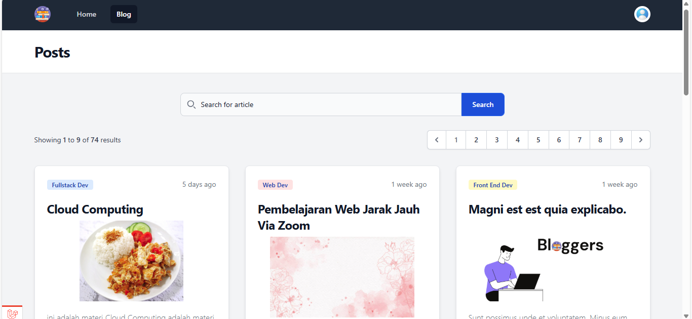

# Blogger
Merupakan aplikasi project pembuatan blog sederhana untuk aplikasi berbasis web


## Fitur yang telah dibuat

 - Pengolahan User (admin)
 - Pengolahan Post (semua user)
 - Pengolahan Category (admin)

## Teknologi

 - Tailwind 3
 - Laravel 11

## Instalasi

Clone Repository

```
git clone https://github.com/AriSyafri/bloggers.git 
```


install denpendencies dengna composer install

```
 composer install 
```

```
Copy file .env.example cp .env.example .env
```

karena menggunakan sql lite dapat mencoba lanjut dengna migrate

lakukan migrate database dengan php artisan 
```
php artisan migrate 
```

lakukan install package json  
```
npm instal package.json 
```


lakukankey generate dan bersihkan cache  
```
php artisan key:generate
php artisan config:cache
```

jalankan php artisan serve

# Screenshoot Contoh
Berikut beberapa contoh hasil yang telah dibuat
### Halaman Home


### Halaman Post

### Halaman Login

### Halaman Register

### Halaman Manage User

### Halaman Manage Post

### Halaman Manage Category

